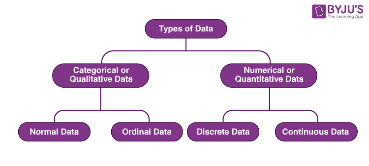

# what is data in DA ?

 1. data is collection of information or set of information i.e called data

 2. data is an collection  instruction i.e stored in structured or raw data or unstructured data.

 3. architectures of data 

 

 **types of data**

 1. structured data
    ```
    examples : table | excel | CSV (comma seprated value)
    ```
 2. unstructured data
    ```
    examples : images | text | files | audio | video 
    ```
 3. raw data

     ```
     examples : json | object etc 

     ``` 