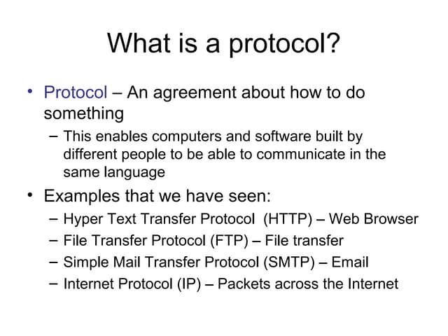
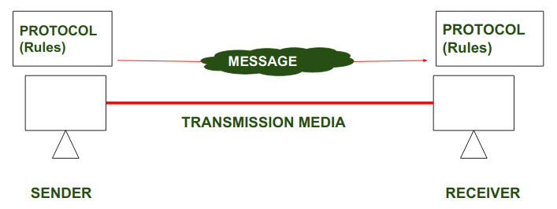

# what is protocol ?

 1. protocol is a set of rules 
 2. protocol is used to set a rules how can your data access on server 
 3. data access secured or unsecured set by protocol 

  


 **architectures of protocol**

  


 **types of protocol**

 1. secured protocol 

    ```
    https://www.mynta.com
    https://www.tops-int.com
    https://www.amazon.in
    https://onlinesbi.sbi.bank.in/
                
    ``` 

  2. unsecured protocol 

    ```
    http://onlinesbi.sbi.bank.in/


    ```

  **list of protocol**

  1. smtp
  2. MIME
  3. ftp
  4. POP
  