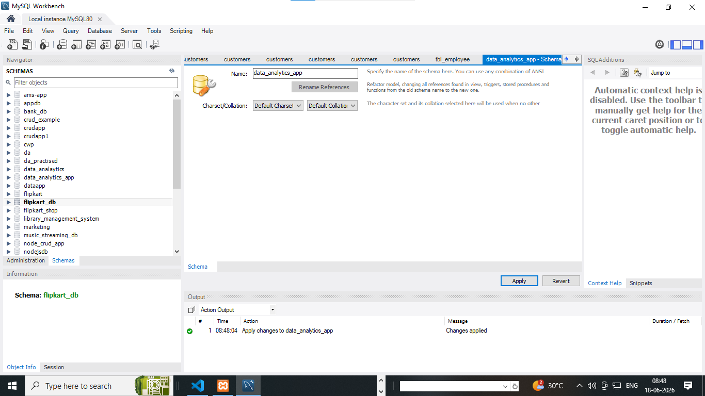
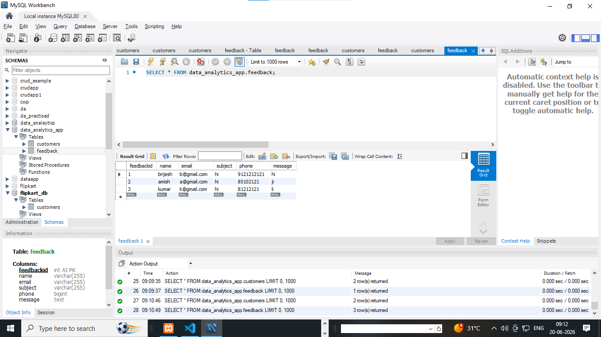
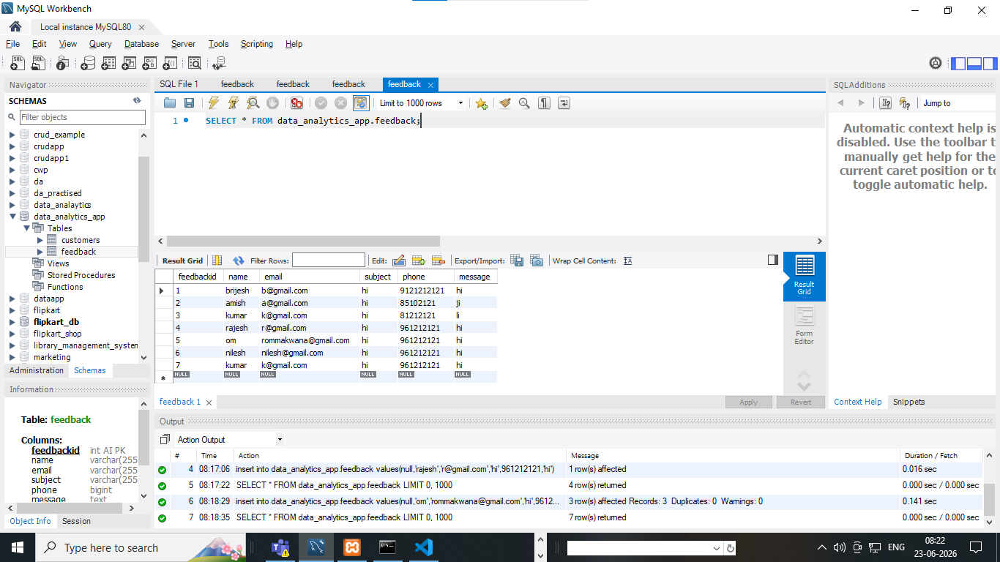
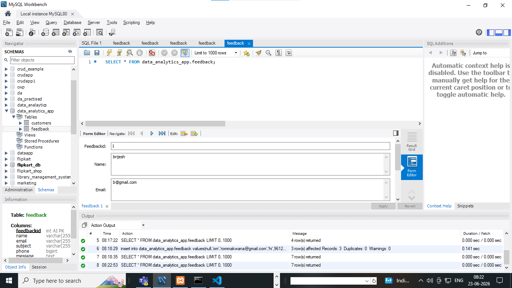

# what is SQL  ?

  1. SQL stands for structured query language
  2. SQL case insenstive language
     examples : INSERT or insert or Insert
  3. sql is used to create an structured of tables or database  
  4. sql is used to create database or tables and manupulate data 
  5. SQL create structures or manipulate data in table 
  6. SQL is maximum create 1032 columns 
  7. SQL is faster to create structured data or insert data or delete data or update data 
 

# employee details table with columnname id, name , email , address , mobile etc

**employee**

| ID  | Name           | Email                     | Phone        | Address                     | Salary |
|-----|----------------|---------------------------|--------------|-----------------------------|--------|
| 101 | John Doe       | john.doe@example.com      | 9876543210   | 12 Main St, New York        | 55000  |
| 102 | Sarah Smith    | sarah.smith@example.com   | 9123456780   | 45 Oak Ave, Chicago         | 62000  |
| 103 | Michael Brown  | michael.brown@example.com | 9988776655   | 78 Pine Rd, California      | 58000  |
| 104 | Emily Johnson  | emily.johnson@example.com | 9012345678   | 23 Lake View, Texas         | 64000  |
| 105 | David Wilson   | david.wilson@example.com  | 9090909090   | 56 Hill St, Florida         | 60000  |


# types of  SQL query or commands

  1. DDL (data definition language)
  2. DML (data manipulate language)
  3. DQL (data query language)
  4. TCL (transanctional query language)


# what is DDL ....  Data definition language

  1. stands for data definition language 
  2. DDL used to create database and table structures 
  3. DDL is also used to drop & alter the database structures and tables data

  **List of command or query in DDL**

  1. create (create database or tables structures)
  2. alter  (alter used to add | modify  | rename  new  column after create tables)
  3. drop
  4. rename
  5. change 
  6. truncate

  **How to create database**

  ```
  syntax ..
  create database databasename
  examples : 
  create database data_analytics
  ```  

  **How to create a table**
  
  **create columnname in tables fixed data-type**

  1. char .....accept character values size(0-255)
  2. varchar .....accept character and numbers both values size(0-255)
  3. int..........accept numbers only default size(0-11)
  4. bigint ......accept more than 11 number default size(0-20)
  5. text.........accept more than 65365 character  
  6. enum .........enumerated accept multiple choices values
  7. date...........accept date formate 
  8. datatime........accept datetime both
  9. float...........accept decimal values 
  10. money..........accept price & all   
  
 **syntax to create table** 

  ```
  create table tablename
  (
  columnname datatype(size) primary key auto_increment,
  columname datatype(size),
  .
  .
  .
  .
  .
  columnname datatype(size)

  );

  ```
  
  **examples of create table***

  ```
  create table employee
(
empid int primary key AUTO_INCREMENT,
name varchar(100),
email varchar(255),
password varchar(255),
address text,
phone bigint,
picode int,
salary float    
)

```

```
create table country
(
cid int primary key AUTO_INCREMENT,
countryname varchar(255),
added_date varchar(255)    

)

```

```
create table feedback
(
id int primary key AUTO_INCREMENT,
name varchar(255),
email varchar(255),
phone bigint,
rating varchar(255),
comment text,
added_date date    
)

```


 **alter**

1. alter : (alter used to add | modify  | rename | drop  a   column after create tables)

```
add new column...

1. alter table employee add added_date date;
2. alter table employee add country varchar(155);
3. alter table employee add photo varchar(255) after empid;

rename any columns 

1. alter table employee change salary employee_salary varchar(255);
2. alter table employee change photo employee_image varchar(255);

delete any columns 

1. alter table employee drop added_date;

```

**drop database & table structured**

```
delete a database and table structured after drop we can not rollback

```

**drop database**

```

drop database databasename
or
drop database data_analytics

```

**drop table only**

```
drop a table it is drop or delete permanently after drop we can not rollback a data or structured of table

drop table tablename
or
drop table country

```

**truncate**

```
truncate delete data or cleared data from table 
after truncate we can not rollback or undo the data 
after truncate it cleared all data 
truncate can not effects on structured its only delete data

syntax ..
truncate table tablename
or
truncate table reviews

```

**rename**

```
rename is used to rename the table
syntax :
rename table tablename to newtablename
or
rename table employee to tbl_employee
or
rename table reviews to tbl_reviews
```


**change**

```
change is used to change any columname in table 
syntax :
alter table tablename change columnname newcolumnname datatype(size);
or
alter table tbl_employee change password employee_password varchar(255);
```


# what is DML ....  Data manipulation language

  1. stands for data manipulation language 
  2. DML used to manipulate data meanse insert | delete | update data in tables 
  3. DML data 

     a. insert 
     b. delete 
     c. update 

**how to insert a single or multiple data in tables**

1. insert a single row in table

   ```
   syntax :

   insert into tablename(columnname1, columnname2) values ('value1','value2');
   or

   insert into tbl_reviews(name,email,phone,rating,comment,added_date) values ('om','om@gmail.com',91212121,'5 star','good i am glad to here','19-05-2026') 

   ```


   2. insert a multiple rows in table

   ```
   syntax :

   insert into tablename(columnname1, columnname2) values ('value1','value2'),('value1','value2'),('value1','value2');
   or
   
   insert into tbl_reviews(name,email,phone,rating,comment,added_date) values ('amish','amish@gmail.com',91212178,'5 star','good i am glad to here','2026-05-19'),('kirtan','kirtan@gmail.com',93212178,'5 star','good i am glad to here','2026-05-19'),('mahesh','mahesh@gmail.com',95212178,'5 star','good i am glad to here','2026-05-19') 

   or

  insert into tbl_reviews values('null','naimish','naimish@gmail.com',91212178,'5 star','good i am glad to here','2026-05-19'),('null','ritesh','ritesh@gmail.com',93212178,'5 star','good i am glad to here','2026-05-19'),('null','kumar','kumar@gmail.com',95212178,'5 star','good i am glad to here','2026-05-19')

   ```

# how to delete data 

  1. delete data is used to delete a data 
  2. delete is also used to delete a particular one rows 
  3. delete is also used to delete with its columnname 
  4. delete is also used to delete a range of data 
  5. delete is also used to delete alternate data 

 **examples of delete**

  ```
  delete from tablename
  or 
  delete from tbl_reviews
  or 
  delete from tbl_reviews where id=5;
  or
  delete from tbl_reviews where name='om';
  or
  delete from tbl_reviews where id between 5 and 10;
  or
  delete from tbl_reviews where id in(12,14,16,19)
  ```   

# how to delete data or rows 

  1. update a rows ...

  ```
   update tablename set colunname='value' where id;
   or
   update tbl_reviews set name='om',email='om007@gmail.com',phone=635898956,rating='5star',comment='good to see you',added_date='2026-05-21' where id=17;
   or
   update tbl_reviews set name='om',email='om007@gmail.com',phone=635898956,rating='5star',comment='good to see you',added_date='2026-05-21' where id=17;

   or

   update tbl_reviews set email='bkpandey.pandey@gmail.com' where id=1;

   or

   update tbl_reviews set email='bkpandey.pandey@gmail.com' where id=1;

   or

   update tbl_reviews set email='mukeshdhandhukiya007@gmail.com' where name='mukesh';   

  ```
  # DQL ..stands for data query language 

  1. DQL stands data query language 
  2. DQL is used to select or fetch data 
  3. DQL is only used select query or command

  **select examples**

  ```
  select * from tbl_reviews;
  or
  select * from tbl_reviews id=1;
  or
  select * from tbl_reviews where id=1;
  or
  select * from tbl_reviews where between 18 and 25;
  or
  select * from tbl_reviews where id in(13,17,20);
  or
  select id,name,email,phone from tbl_reviews;
  or
  select * from tbl_reviews where id limit 1,6;
  or
  select * from tbl_reviews order by name asc
  or
  select * from tbl_reviews order by name desc
  
  ```

# SQL function ....

 1. SQL function provides a group of code 
 2. SQL function is inbuilt function 
 3. SQL function is used to completed any task 

# types of SQL function 

  1. aggrigate function
  2. scalar function 

# aggrigate function 
  1. sum 
  2. avg 
  3. count 
  4. max
  5. min

# scalar function 
  1. first 
  2. last 
  3. ucase
  4. lcase


# sum() : sum used to sum of values 
   
   **syntax**

   ```
   select sum(employee_salary) as sumof_salary from tbl_employee
   ```

# alias : alias is a nick name of any column name     

   ```
    select employee_password as password from tbl_employee
   ```

# avg() : avg used to calculate average values  
   
   **syntax**

   ```
   select avg(employee_salary) as averageofsalary from tbl_employee
   ```

# count() : count used to calculate a count values   
   
   **syntax**

   ```
   select count(empid) as totalnumberemployee from tbl_employee
   or 
   select count(id) as totalreviews from tbl_reviews
   ```
# max() : max used to calculate a max values   
   
   **syntax**

   ```
  select max(employee_salary) as max_salary from tbl_employee
  or
  select max(employee_salary) as max_salary_employee from tbl_employee
   ```

# min() : min used to calculate a min values   
   
   **syntax**

   ```
   
  select min(employee_salary) as min_salary from tbl_employee
  or
  select min(employee_salary) as min_salary_employee from tbl_employee
   ```

# subquery : subquery used a query within another query i.e called subquery 

 1. find a second highest salary from tables 

 ```
   select max(employee_salary) from tbl_employee where employee_salary < (select max(employee_salary) from tbl_employee);
   
   or

   select max(employee_salary) as second_highest_salary from tbl_employee where employee_salary < (select max(employee_salary) from tbl_employee); 

   or

    select max(employee_salary) as second_highest_salary from tbl_employee where employee_salary < (select max(employee_salary) from tbl_employee);

 ```

 2. find a second highest salary from tables using order by and limit

 ```
  select * from tbl_employee order by employee_salary asc limit 1,1;
  or
  select * from tbl_employee order BY employee_salary desc limit 1,1;
  or
  select * from tbl_employee order BY employee_salary desc limit 2,1;

 ```


 3. select data using limit

    ```
    select * from tbl_employee limit 2,2;
    or
    select * from tbl_employee limit 0,4;
    or
    
    select * from tbl_employee limit 0,3;
    or
    select * from tbl_employee limit 4,1;

    ```

# first :find the first rows of data 
 **select first rows**
 ```
  select first(id) from tbl_reviews
 ```  

# last: find the last rows of data

   **select last rows**
   ```
  select last(id) from tbl_reviews
  
  ```

# ucase :convert any columnname of data in uppercase 

  **convert in uppercase**

  ```
  select ucase(name) from tbl_reviews
  or

  ```

# lcase :convert any column name of data in lowercase 

 **convert in lowercase**

  ```
  select lcase(name) from tbl_reviews
  ```
# like operator : searching rows or data from tables using like operator

1. searching data from tables using keyword like operator is used
2. like operator is denoted by % symbol 
3. like is used to search via character word pattern 

```
select * from tbl_reviews where name like 'r%';
select * from tbl_reviews where name like 'n%';
select * from tbl_reviews where name like '%h';
select * from tbl_reviews where name like '%a%';
select * from tbl_reviews where name like 'a%h';
```

# pattern word rules in like operator

| Pattern | Meaning | Example Match |
|---|---|---|
| `'a%'` | Starts with "a" | `"apple"`, `"alpha"` |
| `'%a'` | Ends with "a" | `"banana"`, `"data"` |
| `'%or%'` | Contains "or" in any position | `"world"`, `"orbit"` |
| `'_r%'` | Has "r" in the second position | `"tree"`, `"area"` |
| `'a__%'` | Starts with "a" and is at least 3 chars long | `"apple"`, `"and"` |
| `'a%o'` | Starts with "a" and ends with "o" | `"audio"`, `"alto"` |


# group by : 

1. group by is used to group the data based on any column name
2. group by is used with aggregate function to group the data based on any column name

   1. count
   2. sum
   3. avg
   4. max
   5. min

**syntax**

```
select columnname, aggregate_function(columnname) from tablename group by columnname;

examples:
select name, count(*) as total_reviews from tbl_reviews group by name;
or
select sum(salary), department from tbl_employee group by department;
or
select avg(salary), department from tbl_employee group by department;
or

```


# key constraints in SQL ........

1. key constraints in SQL ...
2. key constraints in SQL set limit on tables 
3. key constraints is ........

   1. primary key 
   2. unique key 
   3. foreign key 


**note:key constraints is also used to normalized tables data**    

**primary key**

1. A pk is never return null value 
2. A pk is always auto_increments
3. A pk is store a unique value 
4. A pk is provides only once in a table


**How to set a PK in table**

```
create table register
(
  
  id int auto_increment primary key,
  name varchar(255)
)

```


**unique key**

1. A uk is  return at least one times a null value 
3. A uk is store a unique value can not accept dublicate values 
4. A uk is provides more than once time in a table


**How to set a UK in table**

1. create a table 
2. create a UK on username & email

```
create table tbl_register
(
rid int AUTO_INCREMENT primary key,
username varchar(155),
email varchar(155),
password varchar(155),
phone bigint,
address text
)

or
alter table tbl_register unique `username`;
or
alter table tbl_register add UNIQUE(`email`);
```


**foreign key**

1. A fk provides relationship b/w one tables to another table 
2. A fk is provides relationship with common field or column name
3. A fk is provides more than one times in a tables 
4. A fk is stored dublicate value in a tables 

**provides a fk in tables**

**tbl_country**

|cid(pk)|countryname   |
|------|---------------|
|   1  |    india      |
|   2  |    usa        |
|   3  |    uk         |
|   4  |    australia  | 


**tbl_users**

|uid(pk)|name   |cid(fk)|
|------|--------|-------|
|   1  | amish  |  2    |
|   2  | om     |  1    |
|   3  | brijesh|  1    |
|   4  | rutwick|  4    | 


**query**

```
create table tbl_country
(
cid int AUTO_INCREMENT primary key,
countryname varchar(255)    
)

or

create table tbl_users
(
uid int AUTO_INCREMENT primary key,
name varchar(255),
age int,
mobile bigint,
address text,
cid int REFERENCES tbl_country(cid)    
)

```

**task on fk based**

1. create a table tbl_department

  | depid(pk)   |  depname   |
  |-------------|------------|
  |    1        |  HR        |
  |    2        |  finance   |
  |    3        |  marketing |


2. create an employee table tbl_employee


  | empid(pk)   |  name      | age  | salary | depid(fk)|
  |-------------|------------|------|--------|----------|
  |    1        |  amish     | 32   | 85500  | 2        |
  |    2        |  om        | 22   | 15500  | 1        |
  |    3        |  brijesh   | 35   | 89500  | 3        | 


# ecommerce database and tables relationship..

**queries**

1. create database data_analaytics

2. create table categories
(
 
catid int AUTO_INCREMENT primary key,
categoryname varchar(255)    

)
3. create table subcategories
(
 
subcatid int AUTO_INCREMENT primary key,
subcategoryname varchar(255)    

)

4. create table products
(
 
pid int AUTO_INCREMENT primary key,
catid int REFERENCES categories(catid),
subcatid int REFERENCES subcategories(subcatid),    
pname varchar(255),
qty int,
price int,
descriptions text
)

# write a query to join tbl_country in tbl_users to fetch countryname in tbl_users

examples : select tbl_users.*,countryname from tbl_users join tbl_country on tbl_users.cid=tbl_country.cid

# student managements table realtionship 

1. department
2. college
3. courses
4. students

**queries**

1. create database data_analaytics

2. create table department
(
 
depid int AUTO_INCREMENT primary key,
depname varchar(255)    

)
3. create table college
(
 
collegeid int AUTO_INCREMENT primary key,
collegename varchar(255)    

)

4. create table courses
(
 
coursesid int AUTO_INCREMENT primary key,
coursesname varchar(255)    

)

4. create table students
(
 
studentid int AUTO_INCREMENT primary key,    
name varchar(255),
email varchar(255),
mobile bigint,
enrollment bigint,
address text,
added_date varchar(255),
depid int REFERENCES department(depid),
coursesid int REFERENCES courses(coursesid),
collegeid int REFERENCES college(collegeid)

)


# sql join more than one tables 

# Question.  w.a.q to fetch students details with its depname | coursesname | collegename from students tables 

examples : select students.*,depname,coursename,collegename from students join department on students.depid=department.depid join courses on students.coursesid=courses.coursesid join college on students.collegeid=college.collegeid

or

examples : select studentid,name,email,mobile,enrollmentnumber,address,depname,coursename,collegename from students join department on students.depid=department.depid join courses on students.coursesid=courses.coursesid join college on students.collegeid=college.collegeid


# SQL join .....


  1. SQL join are used to join more than one tables with common field
  2. SQL join are 4 types 

     1) inner join 
     2) join 
     3) outer join 
        1) left join 
        2) right join 
        3) full join 
     4) cross join  

  **inner join**
  1. SQL inner join are used to join more than one tables with common field 
  2. if data matched from 1st table in second tables with common field its join otherwise return null values

  **syntax**

  ```
  select 1sttablename.*,columnname from 1sttablename inner join 2ndtablename on 1sttablename.commonfield=2ndtablename.ommonfield;
  or

  select tbl_employee.*,depname from tbl_employee inner join tbl_department on tbl_employee.departmentid=tbl_department.departmentid;

  ```   


  
  **join**
  1. SQL  join are used to join more than one tables with common field 
  2. if data matched from 1st table in second tables with common field its join otherwise return null value
  3. join and inner join is same 

  **syntax**

  ```
  select 1sttablename.*,columnname from 1sttablename  join 2ndtablename on 1sttablename.commonfield=2ndtablename.ommonfield;

  or

  select tbl_employee.*,depname from tbl_employee join tbl_department on tbl_employee.departmentid=tbl_department.departmentid;

  ```   

  **left join**

  1. SQL  left join are used to join 1st table of left rows to 2nd table of left rows if data is matched join all otherwise return null values. 


  **syntax**

  ```
  select 1sttablename.*,columnname from 1sttablename  left join 2ndtablename on 1sttablename.commonfield=2ndtablename.ommonfield;

  or

  select tbl_employee.*,depname from tbl_employee left join tbl_department on tbl_employee.departmentid=tbl_department.departmentid;

  ```   

  

  **right join**

  1. SQL  right join are used to join 2st table of right rows to 1st table of right rows if data is matched join all otherwise return null values. 


  **syntax**

  ```
  select 1sttablename.*,columnname from 1sttablename  right join 2ndtablename on 1sttablename.commonfield=2ndtablename.ommonfield;

  or

  select tbl_employee.*,depname from tbl_employee right join tbl_department on tbl_employee.departmentid=tbl_department.departmentid;

  ```   


 **full join**

 1. does not support MySQL 


 **cross join**

 1. cross join with used to join tables with common field and apply cross of tables data 

      **examples**

      ```
      select * from tbl_employee cross join tbl_department

      ```


# case based query and solutions 

 create table tbl_department
(
 
departmentid int AUTO_INCREMENT primary key,
depname varchar(255)    

)

create table tbl_employee
(
 
empid int AUTO_INCREMENT primary key,    
name varchar(255),
email varchar(255),
mobile bigint,
address text,
added_date varchar(255),
salary float,    
departmentid int REFERENCES tbl_department(departmentid)
)


1. create an tbl_department table and add 5 data in table
2. create an tbl_employee table and add 5 employee data in table
3. select all depname in uppercase only 
4. select employe second highest salary with subquery
5. select only 3 employees detail who is stored on 1,3,5 empid
6. select all depname there is no any employee are working 
7. select all employee name who is working in particular depname
8. select employee name in ascending order 
9. select employe second highest salary without subquery using order by and limit

**solutions**

1.  create table tbl_department
(
 
departmentid int AUTO_INCREMENT primary key,
depname varchar(255)    

)
2. create table tbl_employee
(
 
empid int AUTO_INCREMENT primary key,    
name varchar(255),
email varchar(255),
mobile bigint,
address text,
added_date varchar(255),
salary float,    
departmentid int REFERENCES tbl_department(departmentid)
)
3. select ucase(depname) from tbl_department
4. select max(salary) from tbl_employee where salary < (select max(salary) from tbl_employee)
5. select * from tbl_employee where empid in (1,3,5)
6. select * from tbl_employee where name in ('om','brijesh','kumar')
6. select tbl_employee.*,depname from tbl_employee right join tbl_department on tbl_employee.departmentid=tbl_department.departmentid;
7. select tbl_employee.*,depname from tbl_employee inner join tbl_department on tbl_employee.departmentid=tbl_department.departmentid;
7. select tbl_employee.*,depname from tbl_employee join tbl_department on tbl_employee.departmentid=tbl_department.departmentid;    
8. select * from tbl_employee  order by name asc;
9. select * from tbl_employee order by salary desc limit 1,1
10. select tbl_employee.*,depname from tbl_employee join tbl_department on tbl_employee.departmentid=tbl_department.departmentid  order by salary desc limit 1,1;    


# TCL .....

1. TCL stands for trasanctional control language 
2. TCL is used for trasanctinal query 
3. TCL is used to best support in oracle database 
4. TCL is used to commit after delete a row or save after delete a rows 
5. TCL is also rollback a data from tables 

   1. commit : used to save data after delete in TCL 

     ```
       start TRANSACTION;
       delete from tbl_employee where empid=8;
      COMMIT;
 
     ``` 

   2. rollback : rollback is used to rollback data from tables 

     ```
      start TRANSACTION;
      select * from tbl_employee where empid=8;
      rollback;
     ```

     # rollback is not supported in mySQL structured 


 # how rollback works ...  

  1. by default mysql engine should be innoDB 

     check engine 

     ```
     SHOW CREATE TABLE tbl_employee;
     
     ```
     
  2. commit and rollback is supported in oracle in best way but in MySQL support by only in innoDB engines 

     ```
      START TRANSACTION;

      UPDATE tbl_employee
      SET salary = 50000
      WHERE empid = 7;
      COMMIT;


     ```   

     ```
    START TRANSACTION;
    UPDATE tbl_employee
    SET name = 'TEST'
    WHERE empid = 7;

    SELECT * FROM tbl_employee WHERE empid = 7;

    ROLLBACK;

    SELECT * FROM tbl_employee WHERE empid = 7;

  ```

  # update all data

  ``` 
    START TRANSACTION;
    UPDATE tbl_employee
    SET name = 'bhavik',email='bhavik@gmail.com',mobile=98121546,address='150 feet ring road       surat'
    WHERE empid = 7;

    SELECT * FROM tbl_employee WHERE empid = 7;

    ROLLBACK;

    SELECT * FROM tbl_employee WHERE empid = 7;
  ```    


  # If the second SELECT still shows the original value, rollback is working correctly. If it's still not working, share:

  # rollback using delete 

   ```
    START TRANSACTION;
    delete from tbl_employee where empid=7;
    COMMIT;

   ```

   # rollback data or rows 

   ```
    START TRANSACTION;
    delete from tbl_employee
    WHERE empid = 7;

    SELECT * FROM tbl_employee WHERE empid = 7;

    ROLLBACK;

    SELECT * FROM tbl_employee WHERE empid = 7;

    or

    START TRANSACTION;
    delete from tbl_employee
    WHERE empid = 6;

    SELECT * FROM tbl_employee WHERE empid = 6;

    ROLLBACK;

    SELECT * FROM tbl_employee WHERE empid = 6;
   ``` 

 # SQL workbench 4.0 or 2.0 

   1. install mySQL workbench

      

   2. create database 

      ```
      create database database name;
      or
      create via schema

      ```

# how to add data in mysqlWorkbench

   

   
        
        


# what is view in SQL ? 

  1. view is used to create an dublicate table of main table 
  2. view is used to create a virtual tables of main table 
  3. view is used to hide some data from some users there we used view 
  
# syntax :  

  ```
   create view viewname as select columnname1, columnname2...from tablename where empid=1;
   or
   create view viewname as select columnname1, columnname2...from tablename
   or
   create view viewname as select * from tablename;

  ``` 
  # note : view is used to create a dublicate table or virtuals table of main tables 

  # Note:   

   **examples**

   ```
    create view viewname as select columnname1, columnname2...from tablename where empid=1;

    or

    update  tbl_view_users set name='jinal',age=35,mobile=653545454,address='150 feet ring road rajkot',cid=3 where uid=3 

    or

    delete from tbl_view_users  where uid=3 
    
   ```


# SQL indexer or index ? 

  1. index or indexer create to improved SQL speed of tables 
  2. index are used to create optimized speed of tables 
  3. indexer also create to fast search or lookup data from tables 
  4. indexer are used to create one column or multiple columns of table 

     **types of indexer or index**
     1) single indexer(create index on one column)
        **examples**
        ``` 
        create index indexname on tablename columnname1; 
        or
        create index index_tbl_employee on tbl_employee empid;
        ```
     2) composit indexer(create index on one or multiple column)
        **examples**
        ``` 
        create index indexname on tablename (columnname1,columnname2,columnname3,columnname4......);
        or
        
        create index index_tbl_employee on tbl_employee (empid,name,email,mobile,salary) 
        ```


# SQL windows functions ..........

  1. SQL windows function are used to applied just like scalar or aggrigate functions on windows in SQL.
  